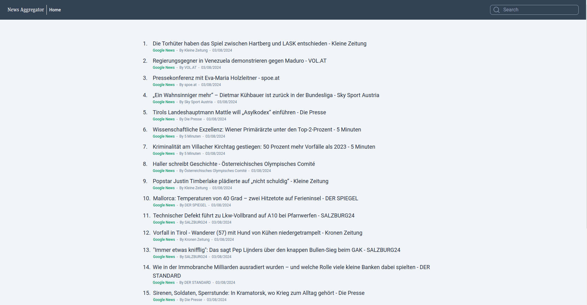
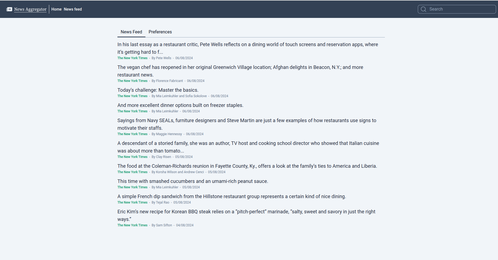
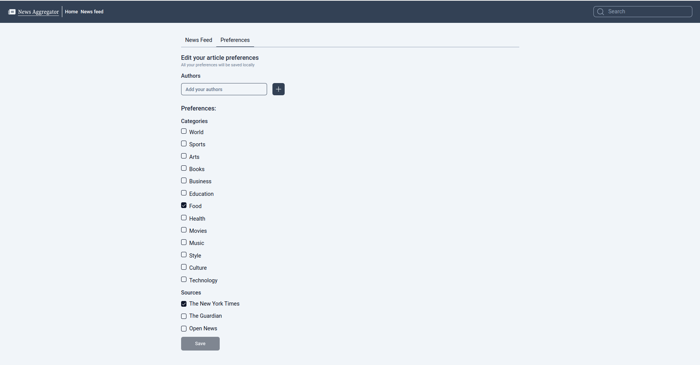

News Agreggator

## About

- [News Agreggator](https://news-aggregator-web-app.vercel.app/) is a project that aggregates news from various places in one place, made with love, nextJs and Tailwindcss.
The project has Lint and also uses Prettier to format Tailwindcss classes. Install the extensions to get the most out of it.

## Getting Started

First, you will need to get 3 api keys, they are from:

- [The New York Times API](https://developer.nytimes.com/)
- [News Api](https://newsapi.org/)
- [The Guardian API](https://open-platform.theguardian.com/)

Get these key and create a .env at the root of the project
there is a .env.example at the root.

to run the project you will need to have [Dockcer](https://www.docker.com/) installed 

execute to create the container:
```bash
docker build -t news-agreggator .
```
than execute this to run the container for the first time:
```bash
docker compose up --build
```
if you want to run the project for the second time run:
```bash
docker compose up
```

## Tests

There are some unit test, if you want to run them, execute:
```bash
npm run test
```

## Overview

The most recent posts from each provider are displayed on the home page, they were loaded server-side and are cached for 30 minutes


By clicking on the header search bar you can search for an article.


By clicking on the 'News Feed' tab you will be redirected to the user's feed. The user can edit preferences on this screen.



#neverstoplearning